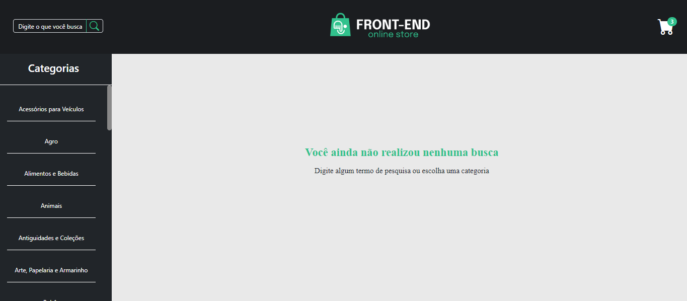
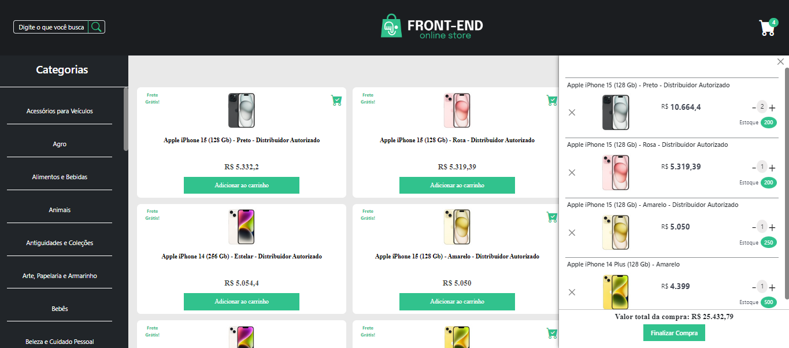
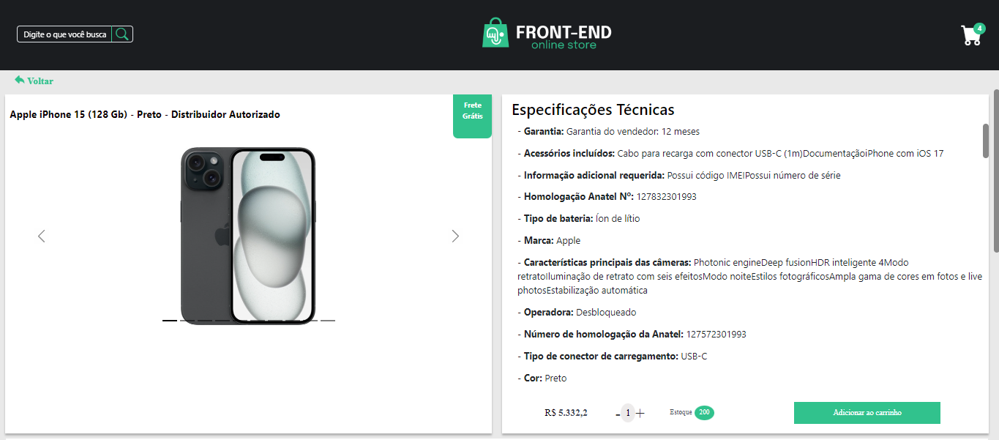
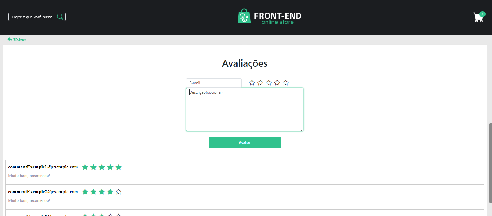
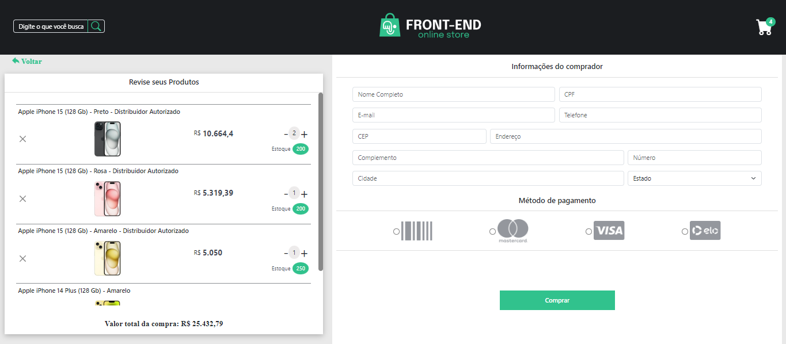

# Frontend Oline Store

  
Preview

  

  <h3>Tela Home vazia:<h3/>
  
  <h3>Tela home com pesquisa:<h3/>
  
  <h3>Tela detalhes de um produto:<h3/>
  
  <h3>Avaliações de um produto:<h3/>
  
  <h3>Tela de finalizar compra<h3/>
  
  

    
### Veja a aplicação funcionando <a title="https://isaque-s-0liveira.github.io/frontend-online-store-TS/" role="link" target="_blank" rel="noopener noreferrer nofollow" class="text-bold" href="https://isaque-s-0liveira.github.io/frontend-online-store-TS/">clicando aqui</a>

# Contexto
O foco principal deste projeto é, com base nos ensinamentos React da Trybe, fazer requisições e consumir dados de uma API, compreender o ciclo de vida dos componentes, mapear caminhos de URL com o componente Route e utilizar o Routes do React Router Dom.

  
O que é a Trybe?🤔

  A Trybe é uma escola de desenvolvimento web genuinamente comprometida com o sucesso profissional de seus estudantes. Com o Modelo de Sucesso Compartilhado (MSC) oferecido pela Trybe Fintech, uma instituição financeira autorizada pelo Banco Central do Brasil, os alunos têm a opção de pagar apenas quando estiverem trabalhando.

---

Frontend oline store é uma aplicação responsiva que consome a API do mercado livre, permitindo aos usuários buscar produtos por termos e categorias, interagir com os produtos, visualizar detalhes e simular a finalização da compra. As principais funcionalidades do Frontend Oline store incluem:

- **Pesquisa de produtos**: Permite que os usuários procurem produtos por termo ou categoria.
- **Listagem de produtos**: Exibe imagem, nome, preço dos produtos, mostrando se possui frete grátis e se já foi adicionado ao carrinho.
- **Visualização dos detalhes de um produto**: Mostra imagens e especificações técnicas de um produto.
- **Interação com os produtos**: Permite o usuário nteragir com os produtos buscados de modo a adicioná-los e removê-los de um carrinho de compras em diferentes quantidades.
- **Avaliações de um produto**: Permite a visualização de avaliações prévias, bem como criar novas avaliações.
- **Simulação de finalização de compra**: Simula a finalização da compra dos itens selecionados.
---

## Técnologias usadas

Front-end:
- [React](https://reactjs.org/)
- [React Router](https://reactrouter.com/en/main)
- [TypeScript](https://www.typescriptlang.org/)
- [Context API](https://reactjs.org/docs/context.html)
- [Bootstrap 5](https://getbootstrap.com/)
- CSS3

## Entre em contato:

